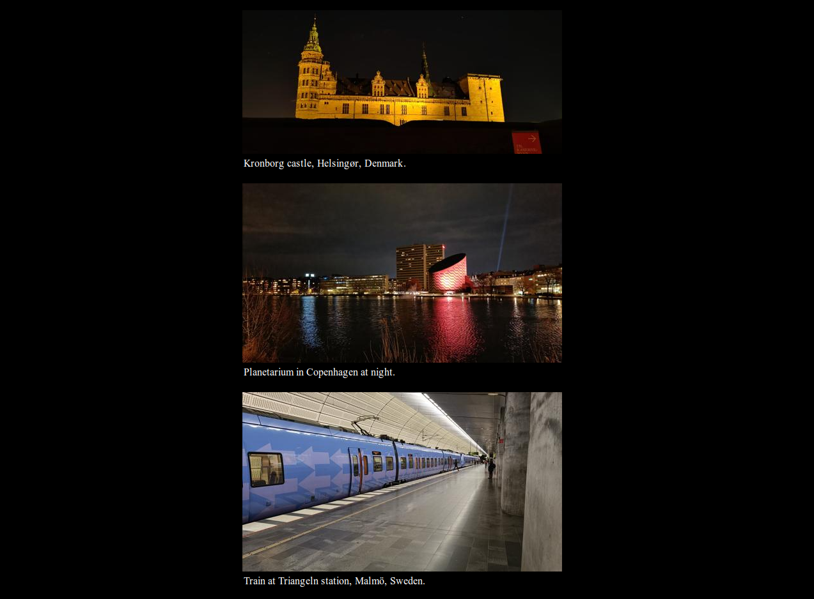
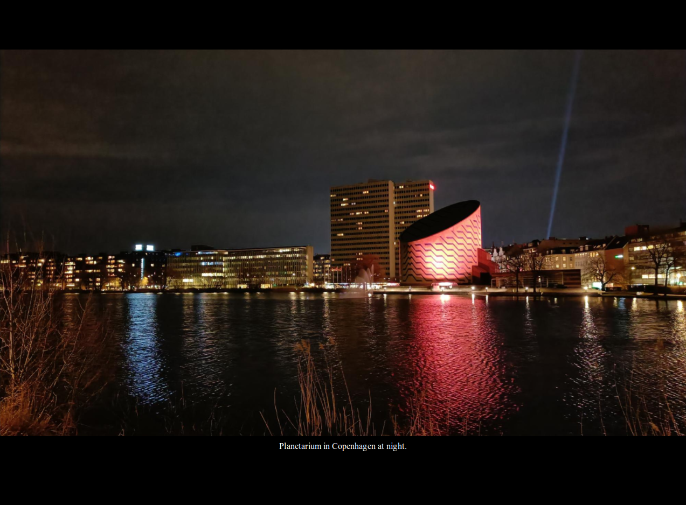

# Gallery

A simple web photo gallery written in React. Features:

- showing a scrollable list of photos
- fullscreen photos viewing - switching to a fullscreen mode in browsers supporting it
- photo description texts
- works well on both mobile devices (fills up the entire display, supports landscape orientation) and desktop computers (really fullscreen image is shown, no more tiny images in small popups on large screens)
- navigation using keyboard (arrows, enter, spacebar, Esc (to exit))
- navigation using swipe gestures (left, right, up (to exit))
- fast (no tons of JS loaded)
- next images preloading
- images importer/converter written in .NET
- working permanent URLs pointing to single photos
- no unnecessary UI elements, buttons, frames, paddings, colors, popups
- no page re-layouts when loading images
- no animations
- no server-side scripts (the React app compiles to a bunch of files suitable for static files hosting)
- no database, no cookies, no dynamic content, no user management/registration
- portrait images are not mixed with landscape images (all landscape images are shown first, then all portrait images)

## Usage

```
git clone https://github.com/milan11/gallery.git
cd gallery
cd web
cp -r public/data_example public/data # activate example data
npm install
npm start # start development server
npm run build # build the app
PUBLIC_URL=/gallery npm run build # build the app to be hosted at the specified path
# copy files in the build directory to some web hosting
```

## Importing own photos

### Option 1 - edit manually

- look at `public/data/default`
- copy the files so that each file will have 2 variants: `l_*` (the large image, width of 2000 pixels is recommended), `s_*` (the small image, width of 500 pixels is recommended)
- edit `_data.json` to contain the file names (without the l\_ and s\_ prefixes), image descriptions and the gallery title
- `_data.json` can optionally contain image dimensions (for both large and small images separately) - when specified, the page will try to avoid re-layouts while loading the images

### Option 2 - use converter

- clear the contents of the `public/data/default` directory
- run the converter:

```
cd ../converter
dotnet run <image_source_directory> ../web/public/data/default
```

- look at `public/data/default`
- edit \_data.json - write image descriptions and the gallery title

## Notes

- contains `.htaccess` file which loads the webapp correctly even when going directly to the photo URL (e.g. `photo/file.jpg`) - for web servers other than Apache a different configuration might be needed
- the directory `public/data` is ignored in GIT - make sure to change this setting or back up your galleries elsewhere
- deploying of the `data_example` directory to a web server is of course not needed

## Screenshots

It has basically only 2 possible screens:

Photos list:



Fullscreen photo:


